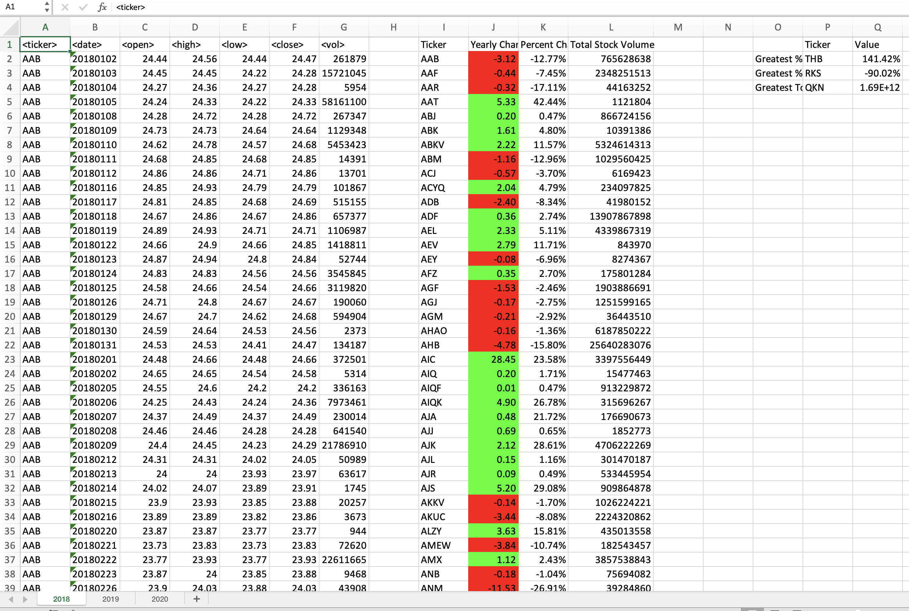

# VBA_challenge
Module 2 Challenge

## Output for first worksheet with workbook summary table

## Stock Analyzer
This project aims to analyze multiple stocks each year on multiple EXCEL worksheets to find each unique stock's annual outcomes of yearly change (with cell color green or red for positive or negative values), percent change, and total volume traded. Additionally, the project identifies the stocks with the greatest percent change as well as the stock with the greatest total volume traded. 

####- 1.	Usage

Ensure you have the necessary stock data in separate EXCEL worksheets for each year and in the same workbook.

Open a VBA module and paste the code in the VBA editor

Run the code

The analyzer will process the stock data and generate the following results:

Yearly change percent change and total volume traded for each unique stock.
Stocks with the greatest percent change.
Stock with the greatest total volume traded.

 #### - 2. Contributing

Contributions to this project are welcome! If you would like to contribute, please follow these guidelines:

Fork the repository and clone it locally.
Create a new branch for your feature or bug fix.
Commit your changes with descriptive commit messages.
Push your branch to your forked repository.
Submit a pull request to the original repository.
Please ensure that your code adheres to the project's coding style and conventions.

If you encounter any issues or have suggestions for improvements, please open an issue on the GitHub repository.

License
This project is licensed under the MIT License.

Additional Sections
There are no additional sections for this project.
